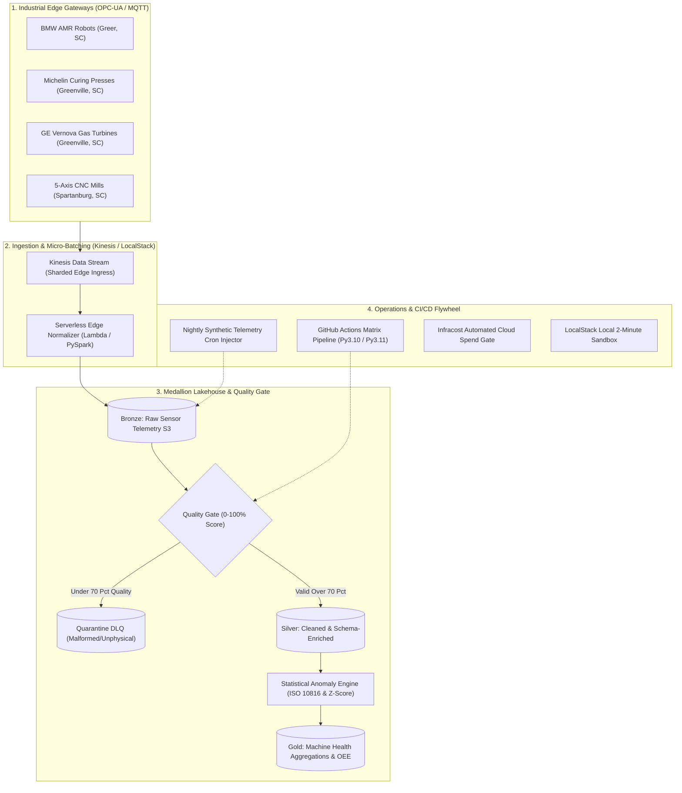

# ⚡ Multi-Cloud Edge Telemetry & Analytical Lakehouse
### *High-Throughput Industrial IoT Ingestion, Automated Quality Gates & Predictive Anomaly Detection*

[](https://github.com/FreeFades2Black/edge-telemetry-lakehouse/actions/workflows/ci.yml)
[](https://github.com/FreeFades2Black/edge-telemetry-lakehouse/actions/workflows/synthetic_injector_cron.yml)
[](https://github.com/FreeFades2Black/edge-telemetry-lakehouse)
[](https://github.com/FreeFades2Black/edge-telemetry-lakehouse)
[](https://github.com/FreeFades2Black/edge-telemetry-lakehouse)

---

## 🎯 Executive Overview & Industry Context

Industrial IoT environments across automotive manufacturing (**BMW Spartanburg AMR Fleets**), tire production (**Michelin MARC Curing Presses**), and energy generation (**GE Vernova HA Gas Turbines**) generate millions of sensor records per second. Unplanned mechanical downtime costs heavy industry over **$50B annually**.

This project provides an enterprise-grade, multi-cloud **Edge Telemetry & Analytical Lakehouse** platform that:
1. **Ingests High-Throughput Edge Sensor Streams** via AWS Kinesis / LocalStack and validates Pydantic data contracts.
2. **Automates Multi-Stage Data Quality Gates** (scoring records 0–100% and isolating corrupt data into quarantine DLQs before Silver promotion).
3. **Applies Statistical Anomaly Detection** combining ISO 10816 vibration standards, acoustic emission cavitation detection, and thermal runaway algorithms.
4. **Maintains a Medallion Delta Lake Architecture** (Bronze $\rightarrow$ Silver $\rightarrow$ Gold) delivering equipment health indices and predictive maintenance schedules.

---

## 🏛️ End-to-End Architecture & Ingress Topology



---

## 📐 Mathematical Methodology & ISO Vibration Standards

### 1. Data Quality Gate Formula
Every telemetry frame is audited across physical bounds, temporal clock drift, and schema completeness:

$$\text{Quality Score} = 100 - \sum (\text{Schema Penalties} + \text{Physical Boundary Violations} + \text{Temporal Drift})$$

* Records with $\text{Quality Score} \ge 70.0$ and zero missing required fields are promoted to **Silver**.
* Out-of-bounds readings are quarantined to protect analytical models from false alarms.

### 2. Machine Health Index & Vibration Limits (ISO 10816-3)
The engine scores physical degradation against standard industrial thresholds:

$$\text{Machine Health Index} = \begin{cases} 
100 - \left(\frac{\text{Vibration RMS}}{\text{Warning Limit}} \times 15\right) & \text{if Normal} \\
\max\left(55, 80 - \frac{\text{Vibration RMS}}{\text{Warning Limit}} \times 15\right) & \text{if Warning} \\
\max\left(10, 50 - \frac{\text{Vibration RMS}}{\text{Critical Limit}} \times 20\right) & \text{if Critical}
\end{cases}$$

---

## 🚀 2-Minute Local Sandbox Quickstart

Hiring managers and platform engineers can spin up the full pipeline locally with zero AWS credentials:

```bash
# 1. Clone the repository
git clone https://github.com/FreeFades2Black/edge-telemetry-lakehouse.git
cd edge-telemetry-lakehouse

# 2. Install dependencies & initialize environment
make init

# 3. Execute PyTest test suite (100% pass rate)
make test

# 4. Execute full Bronze ➔ Silver ➔ Gold pipeline locally
make run-local
```

### LocalStack Emulation & Docker Sandbox
```bash
# Spin up LocalStack (Kinesis, S3, Lambda, DynamoDB)
make localstack-up

# Validate Terraform configuration against LocalStack
make plan
```

---

## 🔄 Automated CI/CD Automation Chamber

* **Python Matrix Testing:** Evaluates PySpark data models against Python 3.10 and 3.11 in parallel.
* **Trivy Vulnerability Scan:** Audits filesystem dependencies and Terraform IaC definitions for CVEs.
* **Nightly Cron Ingestion:** Automatically executes synthetic micro-batches nightly at 02:00 UTC to maintain live Gold analytical snapshots.
* **Infracost PR Cost Diff:** Calculates exact infrastructure spend deltas on every pull request.

---

## ⚖️ License & Attribution

* **License:** MIT Open Source
* **Lead Architect:** Free (`FreeFades2Black`)
