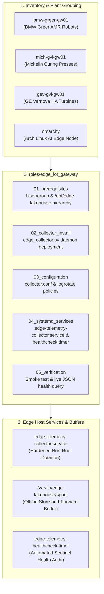

# 🏭 Industrial Edge IoT Gateway Automation (Ansible)
### *Fleet Provisioning & Telemetry Daemon Lifecycle for BMW, Michelin & GE Vernova Facilities*

[](https://github.com/FreeFades2Black/edge-telemetry-lakehouse)
[](https://github.com/FreeFades2Black/edge-telemetry-lakehouse)
[](https://github.com/FreeFades2Black/edge-telemetry-lakehouse)

---

## 🎯 Architectural Overview

In automotive assembly, tire curing, and gas turbine manufacturing, edge gateways installed on industrial IPCs (Beckhoff, Siemens Microbox, OnLogic, or bare-metal Linux nodes) must ingest high-frequency sensor readings (vibration RMS, temperature, RPM, hydraulic pressure, acoustic emission) and reliably forward them to the **Multi-Cloud Analytical Lakehouse**.

This Ansible automation suite deploys, configures, and operates the **Factory Edge IoT Gateway (`roles/edge_iot_gateway`)**:



---

## 📂 Directory Structure

```text
ansible/
├── ansible.cfg                          # Global Ansible runtime config & SSH multiplexing
├── inventory/
│   ├── hosts.ini                        # Plant inventory (BMW Greer, Michelin, GE Vernova, Omarchy)
│   └── group_vars/
│       ├── all.yml                      # Global lakehouse buffer sizes, intervals & endpoints
│       └── factory_edge_gateways.yml    # Systemd resource quotas & log rotation policies
├── playbooks/
│   ├── site.yml                         # Master fleet deployment entrypoint
│   ├── provision-edge-gateways.yml      # Main role provisioning playbook
│   └── verify-edge-health.yml           # Operational audit & buffer queue health check
└── roles/
    └── edge_iot_gateway/
        ├── defaults/main.yml            # Default ports, paths, and anomaly rates
        ├── handlers/main.yml            # Systemd reloads and service restarts
        ├── meta/main.yml                # Galaxy role metadata and OS compatibility
        ├── tasks/
        │   ├── main.yml                 # Master task router with tags
        │   ├── 01_prerequisites.yml    # Users, groups, and kernel TCP tuning
        │   ├── 02_collector_install.yml # Python executable installation
        │   ├── 03_configuration.yml    # collector.conf & logrotate deployment
        │   ├── 04_systemd_services.yml # Systemd unit & timer lifecycle
        │   └── 05_verification.yml      # Smoke test & assertion gates
        └── templates/
            ├── collector.conf.j2
            ├── edge_collector.py.j2
            ├── edge-telemetry-collector.service.j2
            ├── edge-telemetry-healthcheck.service.j2
            ├── edge-telemetry-healthcheck.timer.j2
            └── edge-lakehouse.logrotate.j2
```

---

## 🚀 Quickstart & Operational Commands

### 1. Syntax Validation
```bash
ansible-playbook -i inventory/hosts.ini playbooks/provision-edge-gateways.yml --syntax-check
ansible-playbook -i inventory/hosts.ini playbooks/verify-edge-health.yml --syntax-check
```

### 2. Dry-Run / Check Mode
```bash
ansible-playbook -i inventory/hosts.ini playbooks/provision-edge-gateways.yml --check
```

### 3. Deploy to Edge Fleet (or Specific Plant)
```bash
# Deploy to entire multi-plant fleet
ansible-playbook -i inventory/hosts.ini playbooks/provision-edge-gateways.yml

# Deploy exclusively to BMW Greer Assembly
ansible-playbook -i inventory/hosts.ini playbooks/provision-edge-gateways.yml --limit greer_plant

# Deploy to Omarchy Edge Node
ansible-playbook -i inventory/hosts.ini playbooks/provision-edge-gateways.yml --limit omarchy_edge
```

### 4. Verify Live Health & Queue Depths
```bash
ansible-playbook -i inventory/hosts.ini playbooks/verify-edge-health.yml
```

---

## 🛡️ Security Hardening & Isolation

The `edge-telemetry-collector.service` systemd unit includes the following isolation directives:
* `User=edge-iot` & `Group=industrial`: Runs without root privileges.
* `NoNewPrivileges=true`: Prevents privilege escalation.
* `ProtectSystem=full`: Mounts `/usr`, `/boot`, and `/etc` read-only for the daemon process.
* `ProtectHome=true`: Completely isolates `/home`, `/root`, and `/run/user`.
* `PrivateTmp=true`: Restricts access to global `/tmp`.
* `MemoryMax=512M` & `CPUQuota=50%`: Prevents runaway memory/CPU consumption on edge IPCs.

---

## 🔄 Store-and-Forward Offline Resilience

When plant WAN connectivity drops, the collector does not drop sensor telemetry frames:
1. Batches are serialized and saved atomically into `/var/lib/edge-lakehouse/spool/`.
2. The healthcheck sentinel monitors `spool_queue_depth` and alerts if buffer exceeds `max_buffer_mb` (default 512 MB).
3. Upon network restoration, spooled frames are transmitted in FIFO order to the Lakehouse Bronze Ingestion endpoint.
